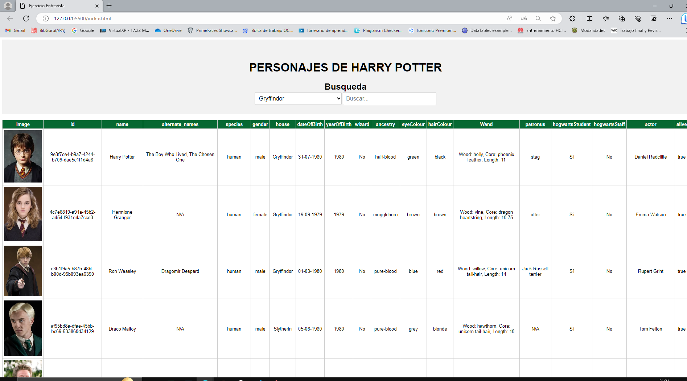
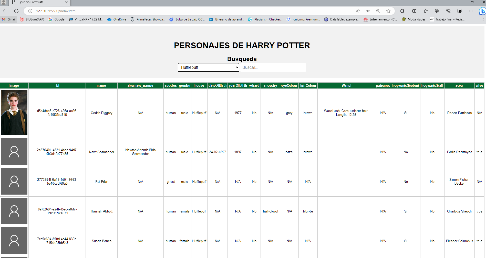
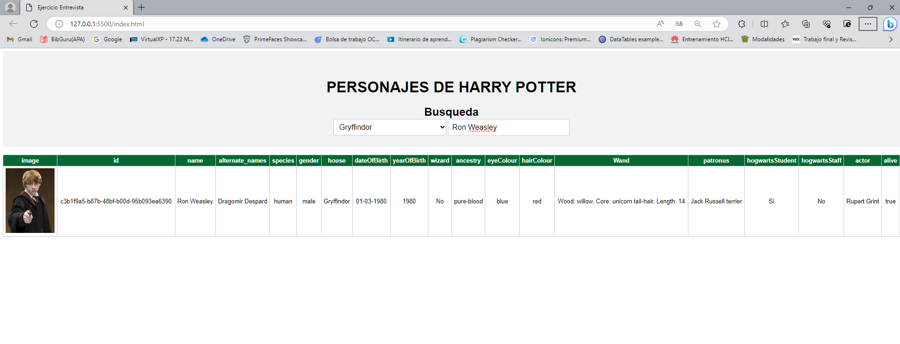
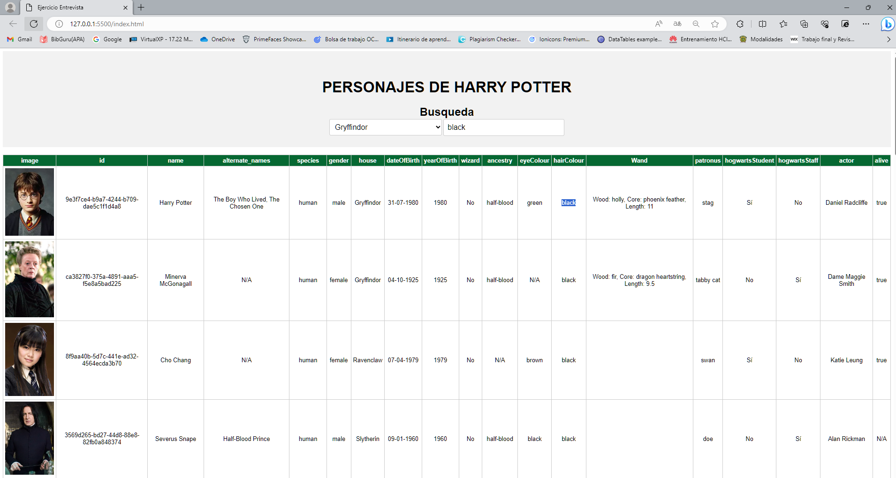
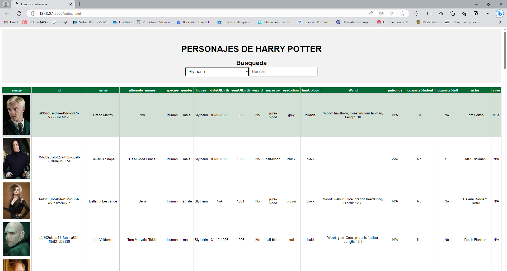

# Ejercicio-Entrevista
Ejercicio Rosendo Vega Mateos

## Vista Principal 
**Al cargar la pgina, realiza la conexion con la API y muestra en forma de tabla los valores obtenidos.**
 

 ## Vista Registros sin imagen
**Si hay registros que no tienen imagen, se les agrega una por defecto.**
 

  ## Vista busqueda por input
**Podemos escribir el nombre de algun personaje en el input y nos lo buscara en la API. **
 

  ## Vista busqueda por coincidencia con el texto
**Podemos escribir alguna caracteristica en el input y nos mostrara las coincidencias.**
 

  ## Vista busqueda por select 
**Al seleccionar una opción del select nos muestra la busqueda **
 

## Autor
*"Rosendo Vega Mateos"*
